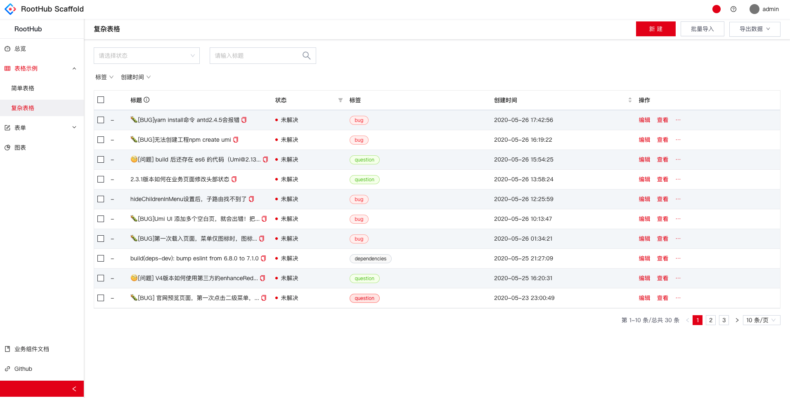

# rh-template-react-umi

基于 Umi 的工程脚手架，http://umi.leekhub.com



## 依赖

- Antd 4.14.x
- Umi 3.5.x
- React 17.0
- bizcharts
- axios
- ……

## 功能特点

- [@roothub/components](http://components.leekhub.com/) 组件
- Antd 样式覆写，满足 UI 风格
  - 如果要去掉，可以注释`styles/reset/index.less`
- Swagger Doc Api TypeScript 接口代码生成
- 主题换色

## 使用说明

Install dependencies,

```bash
$ yarn
```

Start the dev server,

```bash
$ yarn start
```

## 开发说明

- 项目引入了百度 amis 的样式库，见`styles/helper.css` ，文档：https://baidu.gitee.io/amis/zh-CN/style/index
- [文件夹结构](https://pro.ant.design/zh-CN/docs/folder)
- 更多开发规范见：[https://pro.ant.design](https://pro.ant.design/zh-CN/docs/introduction)

## @roothub/cli 根据配置文件生成代码（推荐使用）

TypeScript 的 API 生成通过自研 `@roothub/cli` 来生成，生成的文件夹在 `src/rh/**` 之下。

安装工具包 `npm i @roothub/cli -g`

- `http-client.ts` 封装 Axios 请求拦截，建议生成 api 时不要覆盖。

## @roothub/cli 生成 swagger 接口代码

安装工具包 `npm i @roothub/cli -g`

- rh codegen init 生成配置文件

- rh codegen update 生成 api，并询问是否再生成 mock

- `http-client.ts` 封装 Axios 请求拦截，建议生成 api 时不要覆盖。

- 更多操作 rh codegen -h

### 生成 api 代码

**BaseApi**

```bash
rh api http://81.70.xx.84/leekhub-model-server/v2/api-docs?group=LEEKHUB%20SERVER%20base%20API -n
```

执行示例 eg:

```
🍖️   找到 BaseApi 资源
✅   生成接口文件：/Users/giscafer/Code/leekhub-web/src/rh/apis/Base/data-contracts.ts
✅   生成接口文件：/Users/giscafer/Code/leekhub-web/src/rh/apis/Base/Api.ts
```

生成代码有规范校验问题，就执行以下 `yarn lint:api`

## 其他

拓扑图\统计图表

- Diagram Maker: https://awslabs.github.io/diagram-maker/
- Topology : http://topology.le5le.com/
- G6: https://g6.antv.vision/
  - graphin: https://graphin.antv.vision/graphin/quick-start/overview/
- bizcharts ： https://www.bizcharts.net/
